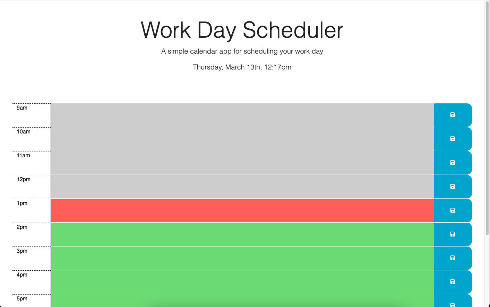

# <Work-Day-Scheduler>

## Description

This Work Day Scheduler challenged me to put my localStorage and DOM manipulation knowledge to the test, creating dynamic HTML elements that change throughout the day according to time provided by the DayJS API. The project allows users to plan their workday in a simple and color coordinated webpage.

## Installation

https://judemdonahue.github.io/Work-Day-Scheduler/

## Usage

Provide instructions and examples for use. Include screenshots as needed.

To add a screenshot, create an `assets/images` folder in your repository and upload your screenshot to it. Then, using the relative file path, add it to your README using the following syntax:

## Credits

API - day.js - created by iamkun - https://github.com/iamkun/dayjs

## License

Refer to license in repo (MIT License)

---

